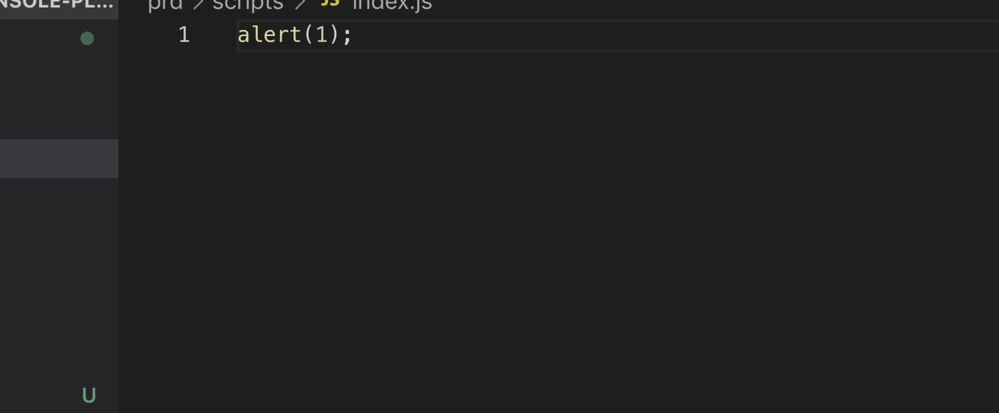
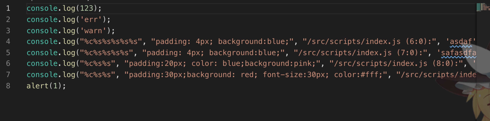
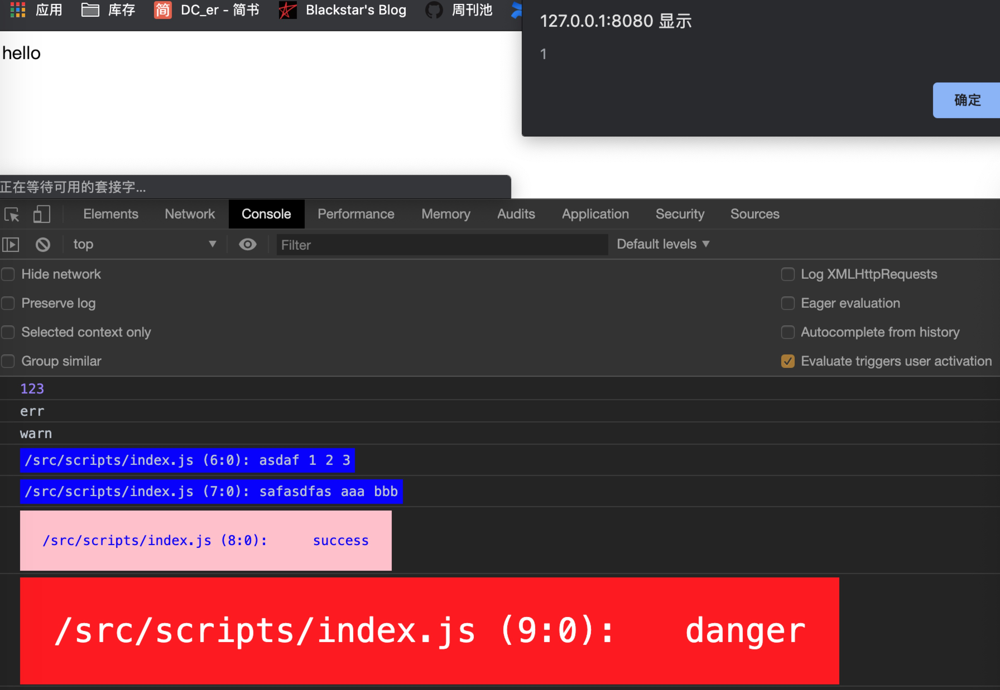

<div align="center">
  <a href="#">
    
  </a>
  <h1 align="center">
    console-transform
  </h1>
</div>

**:rainbow:一个生产环境删除console，开发环境扩展console支持打印颜色和代码位置的babel插件**


🌰源码：


🌰生产环境：



🌰非生产环境：



:film_projector:效果：



## 特性 :grinning:

:x: 生产环境删除所有console，也可以通过glob字符串或者函数来自定义删除逻辑

:rainbow: 非生产环境可以扩展console方法，默认提供了几种console方法，green、blue、orange、red、bgGreen、bgOrange、bgBlue、bgRed

🏷️ 扩展的方法会自动添加代码文件和行列数，如 `/src/scripts/inde.js (10:5)`

## 安装 :kissing_smiling_eyes:

```
npm install --save-dev babel-plugin-console-transform
```
or
```
yarn add --dev babel-plugin-console-transform
```

## 使用 :thinking:

在.babelrc.js引入插件并配置

```javascript
const consoleTransformPlugin = require('babel-plugin-console-transform');

module.exports = {
    plugins: [
        [
            consoleTransformPlugin,
            {
                env: 'production',
                removeMethods: ["*g*", (args) => args.includes('xxxx')],
                additionalStyleMethods: {
                    'success': 'padding:10px; color:#fff;background:green;',
                    'danger': 'padding:20px; background:red;font-size:30px; color:#fff;'
                }
            }
        ]
    ]
}
```

## 配置项 :sunglasses:

| **配置项名称** | **是否必须** | **含义** | **类型** | **举例** |  
| --- | --- | --- | --- | --- |  
| env | 是 | 运行环境 | string | production, development|  
| removeMethods  | 否 | production下删除的方法，默认删除全部 | Array<string \| Function> |  ['log', 'warn'], [(args) => args.includes('dont remove'), 'log']
| additionalStyleMethods | 否  | 额外添加的console方法 | {[key: string]: string}|  {'success': 'background: green;'}|

### 其他说明：:unamused:

 :tomato: `env` 配置时可以使用 `process.env.NODE_ENV` 指定

 :kiwi_fruit: `removeMethods` 在 env 为 production 时才会生效，支持 [glob模式](https://github.com/mrmlnc/fast-glob#basic-syntax) 的字符串，比如 `\*\*g**`, `**bg{Red,Green}` 等，也支持函数，参数为console方法的参数，用于一些需要根据参数确定是否删除console的场景。

 :peach: `additionalStyleMethods`可以扩展一些方法，而且可以覆盖原生的log等方法

 :grapes: 所有扩展的方法都会额外打印文件路径和代码所在行列数
## 相关文章

[如何用 typescript 写一个处理 console 的 babel 插件](https://mp.weixin.qq.com/s?src=11&timestamp=1579079212&ver=2098&signature=Ayp3NWXgckE-xYsbXn9iWFZr*NKdkym7cZI5-s39Ip5a5Ldh8on7d6AM9RhO1ceClpnDSEIQcHohhyTa*xoZ4-jnP0cxFopjQFoDnYOABXhyr-V8U*SNXV4TCxXsZYC1&new=1)
   
## 贡献 :heart:
欢迎任何形式的贡献。你可以用 [pull requests](https://github.com/lingxiaoguang/babel-plugin-console-transform/pulls) 或 [issues](https://github.com/lingxiaoguang/babel-plugin-console-transform/issues) 的方式提交任何想法。  

## License
[MIT](https://github.com/lingxiaoguang/babel-plugin-console-transform/blob/master/LICENSE). Copyright (c) 2019 lingxiaoguang
   
